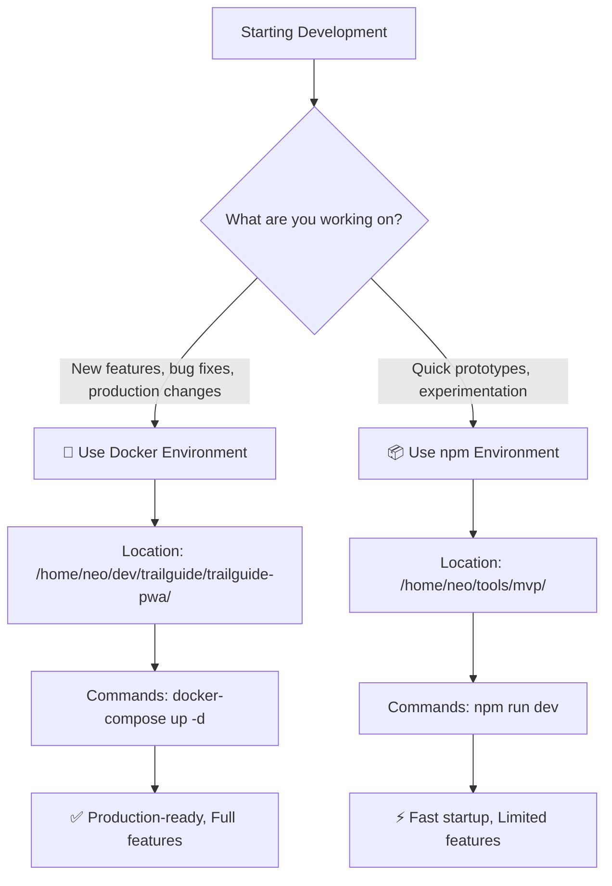

# 🚀 Developer Onboarding Guide - TrailGuide PWA

**Welcome to TrailGuide PWA!** This guide will get you from zero to productive development in under 15 minutes.

> ⚠️ **CRITICAL: Read this entire guide before starting any development work**  
> This project has a specific architecture that prevents common development confusion.

---

## 🎯 Quick Environment Decision

### Which Development Environment Should You Use?



### 🐳 Docker Environment (RECOMMENDED)
**Use for:** Production features, bug fixes, collaboration, final testing

✅ **Advantages:**
- Complete production parity
- Full database with real data
- Authentication system working
- Hebrew RTL support complete
- Multi-container architecture
- Ready for deployment

❌ **Trade-offs:**
- Slower startup (30-60 seconds)
- Requires Docker knowledge
- Container restart needed for backend changes

### 📦 npm Environment (EXPERIMENTAL)
**Use for:** Quick prototypes, isolated component testing, experimentation

✅ **Advantages:**
- Instant startup (5 seconds)
- Hot reload for all changes
- Simple debugging
- Lower resource usage

❌ **Limitations:**
- Mock data only
- Authentication may be incomplete
- Not production-representative
- May have missing features

---

## 🚀 Getting Started (Choose Your Path)

### Path A: Docker Development (Recommended)

```bash
# 1. Navigate to main project
cd /home/neo/dev/trailguide/trailguide-pwa/

# 2. Start the complete stack
docker-compose up -d

# 3. Verify services are running
docker-compose ps

# 4. Open application
# Frontend: http://localhost:5173
# API: http://localhost:3000

# 5. Test login with demo account
# Email: demo@example.com
# Password: demo123
```

**✅ You're ready! Skip to [Development Workflow](#development-workflow)**

### Path B: npm Development (Experimental)

```bash
# 1. Navigate to experimental environment
cd /home/neo/tools/mvp/frontend/

# 2. Install dependencies (first time only)
npm install

# 3. Start development server
npm run dev

# 4. Open application
# http://localhost:5173
```

**⚠️ Note:** This environment may have limitations. Switch to Docker for production work.

---

## 🏗️ Architecture Overview

### Project Structure
```
TrailGuide PWA (Two Environments)
│
├── 🐳 Production Environment
│   ├── Location: /home/neo/dev/trailguide/trailguide-pwa/
│   ├── Stack: Docker + PostgreSQL + Redis + Express + React
│   ├── Features: Complete authentication, Hebrew RTL, Database
│   └── Use for: Real development work
│
└── 📦 Experimental Environment  
    ├── Location: /home/neo/tools/mvp/
    ├── Stack: npm + Vite + Mock data
    ├── Features: Fast development, component testing
    └── Use for: Prototyping only
```

### Key Files Locations

| Component | Docker Environment | npm Environment |
|-----------|-------------------|-----------------|
| Frontend | `/home/neo/dev/trailguide/trailguide-pwa/frontend/` | `/home/neo/tools/mvp/frontend/` |
| Backend API | `/home/neo/dev/trailguide/trailguide-pwa/api/` | *Not available* |
| Database | PostgreSQL container | *Mock data* |
| Documentation | `/home/neo/dev/trailguide/trailguide-pwa/dev/` | `/home/neo/tools/mvp/dev/` |

---

## 🛠️ Development Workflow

### Daily Development Commands

**Docker Environment:**
```bash
# Start your day
cd /home/neo/dev/trailguide/trailguide-pwa/
docker-compose up -d

# View logs
docker-compose logs -f api
docker-compose logs -f frontend

# Make changes to code (auto-reload for frontend)
# Restart API after backend changes:
docker-compose restart api

# Stop at end of day
docker-compose down
```

**npm Environment:**
```bash
# Start development
cd /home/neo/tools/mvp/frontend/
npm run dev

# Changes auto-reload automatically
# No database operations available
```

### Making Code Changes

1. **Choose your environment** based on the decision flowchart above
2. **Make your changes** in the appropriate location
3. **Test thoroughly** in the same environment
4. **Switch to Docker environment** for final testing before commits
5. **Commit from Docker environment** to ensure consistency

### Environment Validation

Before starting work, validate you're in the correct environment:

```bash
# Check if you're in Docker environment
pwd | grep -q "/home/neo/dev/trailguide/trailguide-pwa" && echo "✅ Docker Environment" || echo "❌ Not Docker Environment"

# Check if you're in npm environment  
pwd | grep -q "/home/neo/tools/mvp" && echo "✅ npm Environment" || echo "❌ Not npm Environment"

# Verify Docker services are running (Docker environment only)
docker-compose ps 2>/dev/null | grep -q "Up" && echo "✅ Docker services running" || echo "❌ Docker services not running"
```

---

## 🚨 Common Pitfalls & Solutions

### Problem: "I can't find the file I just edited"
**Cause:** You're looking in the wrong environment  
**Solution:** Check your current directory with `pwd`

### Problem: "Changes aren't showing up"
**Cause:** You're running the app from a different environment than where you made changes  
**Solution:** Ensure you're running and editing in the same environment

### Problem: "Database/Authentication not working"
**Cause:** You're using npm environment for features that require Docker  
**Solution:** Switch to Docker environment: `cd /home/neo/dev/trailguide/trailguide-pwa/ && docker-compose up -d`

### Problem: "Docker is too slow for quick changes"
**Cause:** Using Docker for simple component testing  
**Solution:** Use npm environment for rapid prototyping, then move to Docker for integration

---

## 📚 Documentation Navigation

### Essential Reading Order
1. **This file** - Environment decision and setup ✅ (You are here)
2. **[Quick Start Guide](dev/quick-start.md)** - Detailed Docker setup
3. **[CLAUDE.md](dev/CLAUDE.md)** - AI assistant guidance
4. **[Implementation Status](dev/implementation-status.md)** - What's working

### Reference Documentation
- **[Technical Specification](dev/technical-spec.md)** - Database & API specs
- **[Frontend Architecture](dev/frontend-architecture.md)** - React component patterns
- **[Docker Setup](dev/docker-setup.md)** - Complete Docker configuration

---

## 🎯 Getting Help

### Before Asking for Help
1. ✅ Confirm you're in the correct environment for your task
2. ✅ Check if the issue exists in both environments
3. ✅ Review the documentation for your specific environment

### Quick Debugging
```bash
# Docker Environment Health Check
docker-compose ps
docker-compose logs --tail=20 api
docker-compose logs --tail=20 frontend

# npm Environment Health Check
npm run dev # Should start without errors
curl http://localhost:5173 # Should return HTML
```

### When to Switch Environments
- **Switch to Docker** when npm environment is insufficient
- **Switch to npm** when you need rapid iteration on UI components
- **Always test in Docker** before committing changes
- **Always commit from Docker** environment

---

## ✅ Next Steps

1. **Choose your environment** using the decision flowchart
2. **Follow the setup instructions** for your chosen path
3. **Test the demo login** to verify everything works
4. **Read the [Quick Start Guide](dev/quick-start.md)** for detailed workflows
5. **Start developing!** 🚀

**Remember:** When in doubt, use the Docker environment. It's production-ready and prevents environment-specific bugs.

---

*This guide was created to prevent the confusion that led to dual translation systems and mixed development environments. Following this guide ensures consistent, maintainable development practices.*