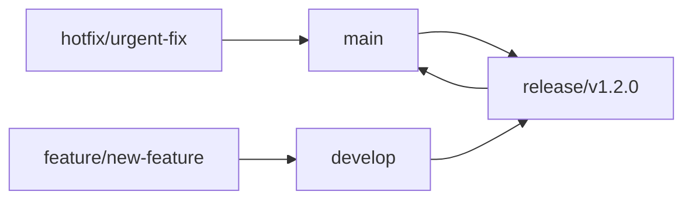

# TrailGuide PWA - Professional Setup

Enterprise-grade multi-environment development workflow for the TrailGuide Progressive Web Application with comprehensive Hebrew RTL support.


## 🏗️ Architecture Overview

This is a complete **enterprise-grade** setup featuring:

- ✅ **Multi-Environment Isolation**: DEV → STAGING → PROD
- ✅ **GitFlow Workflow**: Feature branches, releases, hotfixes
- ✅ **Comprehensive CI/CD**: Automated testing, security scanning, deployment
- ✅ **Production-Grade Security**: Multi-layered security with monitoring
- ✅ **Blue-Green Deployments**: Zero-downtime production deployments
- ✅ **Real-time Monitoring**: Prometheus, Grafana, alerting
- ✅ **Hebrew RTL Support**: Complete right-to-left interface implementation

## 🌍 Environments

| Environment | URL | Purpose | Auto-Deploy |
|------------|-----|---------|-------------|
| **Development** | `http://localhost:8080` | Local development with hot reload | Manual |
| **Staging** | `https://staging.trailguide.app` | Production-like testing | ✅ Auto (develop branch) |
| **Production** | `https://app.trailguide.app` | Live production environment | Manual (tags only) |

## 🚀 Quick Start

### Prerequisites

- Docker & Docker Compose
- Node.js 18+
- Git
- Make (optional)

### Development Environment

```bash
# Clone the repository
git clone <repository-url>
cd trailguide-professional

# Start development environment
cd environments/dev
docker-compose up -d

# View logs
docker-compose logs -f

# Access application
open http://localhost:8080
```

### Environment-Specific Commands

```bash
# Development
cd environments/dev && docker-compose up -d

# Staging (requires proper credentials)
cd environments/staging && docker-compose up -d

# Production (requires production credentials)
cd environments/prod && docker-compose up -d
```

## 🔄 Development Workflow

### GitFlow Branching Strategy



### Branch Types

- **`main`**: Production releases only (protected)
- **`develop`**: Development integration (protected)
- **`feature/*`**: Individual features
- **`release/*`**: Release preparation
- **`hotfix/*`**: Emergency production fixes

### Development Process

1. **Create Feature Branch**
   ```bash
   git checkout develop
   git pull origin develop
   git checkout -b feature/your-feature-name
   ```

2. **Develop and Test**
   ```bash
   # Make changes
   npm run test
   npm run lint
   npm run type-check
   ```

3. **Create Pull Request**
   ```bash
   git push origin feature/your-feature-name
   # Create PR to develop branch
   ```

4. **Automated Testing**
   - Unit tests
   - Integration tests
   - E2E tests
   - Security scanning
   - Performance testing

5. **Merge to Develop**
   - Auto-deploy to staging
   - Staging verification

6. **Release Process**
   ```bash
   git checkout develop
   git pull origin develop
   git checkout -b release/v1.2.0
   # Update version, changelog
   git push origin release/v1.2.0
   # Create PR to main
   ```

## 🏭 CI/CD Pipeline

### Automated Testing (`develop`, PRs)

```yaml
Test Pipeline:
  ├── Security Scan (Trivy, Semgrep)
  ├── Code Quality (ESLint, Prettier, TypeScript)
  ├── Unit Tests (Jest, Vitest)
  ├── Integration Tests
  ├── E2E Tests (Playwright)
  ├── Performance Tests (Lighthouse)
  ├── Accessibility Tests (axe)
  └── Container Security
```

### Staging Deployment (`develop` push)

```yaml
Staging Pipeline:
  ├── Pre-deployment Checks
  ├── Build & Security Scan
  ├── Database Migration
  ├── Blue-Green Deployment
  ├── Health Verification
  ├── Performance Testing
  └── Notification
```

### Production Deployment (tags)

```yaml
Production Pipeline:
  ├── Pre-production Validation
  ├── Manual Approval Gate
  ├── Build Production Images
  ├── Database Backup & Migration
  ├── Blue-Green Deployment
  ├── Comprehensive Verification
  ├── Monitoring Setup
  └── Release Creation
```

## 🗄️ Database Management

### Migration System

```bash
# Run migrations
./scripts/migrate.sh -e dev|staging|prod

# Dry run
./scripts/migrate.sh -e staging -n

# Rollback (if supported)
./scripts/migrate.sh -e staging -d down -s 1
```

### Environment Isolation

- **Development**: `trailguide_dev` (local PostgreSQL)
- **Staging**: `trailguide_staging` (cloud PostgreSQL)
- **Production**: `trailguide_prod` (HA PostgreSQL cluster)

## 📊 Monitoring & Observability

### Metrics Stack

- **Prometheus**: Metrics collection
- **Grafana**: Visualization and dashboards
- **Alertmanager**: Alert routing and notification
- **Loki**: Log aggregation
- **Promtail**: Log collection

### Key Metrics Monitored

- **Application**: Response times, error rates, throughput
- **Infrastructure**: CPU, memory, disk, network
- **Business**: User registrations, guide creations, engagement
- **Security**: Failed login attempts, suspicious activity
- **Performance**: Page load times, API latency

### Access Monitoring

- **Development**: http://localhost:3001 (Grafana)
- **Staging**: https://staging.trailguide.app/grafana/
- **Production**: https://app.trailguide.app/grafana/ (restricted)

## 🔒 Security

### Security Measures

- **Container Security**: Regular Trivy scans
- **Dependency Scanning**: Automated vulnerability detection
- **HTTPS**: SSL/TLS encryption across all environments
- **Rate Limiting**: API and authentication endpoints
- **CORS**: Properly configured cross-origin policies
- **Headers**: Security headers (HSTS, CSP, X-Frame-Options)
- **Secrets Management**: Environment-specific secret handling

### Compliance

- **GDPR**: Data protection and privacy compliance
- **Security Scanning**: Continuous vulnerability assessment
- **Audit Logging**: Comprehensive action tracking
- **Access Control**: Role-based permissions

## 🌐 Hebrew RTL Support

### Features

- **Complete RTL Interface**: Right-to-left layout optimization
- **Language Switching**: Seamless Hebrew/English toggle
- **Cultural Adaptations**: Hebrew-specific UX patterns
- **Font Support**: Optimized Hebrew typography
- **Date/Time**: Hebrew calendar and formatting support

### Testing RTL

```bash
# Test Hebrew interface
curl -H "Accept-Language: he" http://localhost:8080/

# Verify RTL detection
curl -s http://localhost:8080/ | grep 'dir="rtl"'
```

## 🛠️ Troubleshooting

### Common Issues

1. **Port Conflicts**
   ```bash
   # Check port usage
   docker-compose ps
   netstat -tulpn | grep :8080
   ```

2. **Permission Issues**
   ```bash
   # Fix Docker permissions
   sudo chown -R $USER:$USER .
   ```

3. **Database Connection**
   ```bash
   # Check database health
   docker-compose exec postgres pg_isready
   ```

4. **Service Health**
   ```bash
   # Check all services
   docker-compose ps
   docker-compose logs api
   ```

### Health Checks

```bash
# Development
curl http://localhost:8080/health
curl http://localhost:8080/api/v1/health

# Staging
curl https://staging.trailguide.app/health
curl https://staging.trailguide.app/api/v1/health

# Production
curl https://app.trailguide.app/health
curl https://app.trailguide.app/api/v1/health
```

## 📁 Project Structure

```
trailguide-professional/
├── environments/           # Environment-specific configurations
│   ├── dev/               # Development environment
│   ├── staging/           # Staging environment
│   └── prod/              # Production environment
├── .github/workflows/     # CI/CD pipeline definitions
├── api/                   # Backend API code
├── frontend/              # React PWA frontend
├── monitoring/            # Monitoring configurations
├── scripts/               # Deployment and utility scripts
├── infrastructure/        # Infrastructure as Code
└── docs/                  # Additional documentation
```

## 🤝 Contributing

1. **Follow GitFlow**: Use appropriate branch types
2. **Write Tests**: Ensure good test coverage
3. **Security First**: Follow security best practices
4. **Document Changes**: Update relevant documentation
5. **Test RTL**: Verify Hebrew interface functionality

### Code Standards

- **TypeScript**: Type-safe development
- **ESLint**: Code quality enforcement
- **Prettier**: Consistent formatting
- **Jest/Vitest**: Testing framework
- **Conventional Commits**: Standardized commit messages

## 📝 Environment Variables

### Required Secrets

**Staging:**
- `STAGING_DB_PASSWORD`
- `STAGING_REDIS_PASSWORD`
- `STAGING_JWT_SECRET`
- `STAGING_SSH_PRIVATE_KEY`

**Production:**
- `PROD_DB_PASSWORD`
- `PROD_REDIS_PASSWORD`
- `PROD_JWT_SECRET`
- `PROD_SSH_PRIVATE_KEY`
- `PROD_BACKUP_ENCRYPTION_KEY`

## 🚨 Emergency Procedures

### Emergency Deployment

```bash
# Emergency production deployment (bypasses some checks)
gh workflow run deploy-production.yml \
  -f tag_name=v1.2.3 \
  -f emergency_deploy=true
```

### Rollback Procedures

1. **Application Rollback**
   ```bash
   # Switch to previous blue/green environment
   ssh prod-server "cd /opt/trailguide && ./rollback.sh"
   ```

2. **Database Rollback**
   ```bash
   # Restore from backup (if needed)
   ./scripts/restore-backup.sh -e prod -f backup-file.sql
   ```

## 📞 Support

- **Issues**: GitHub Issues
- **Documentation**: `/docs` directory
- **Monitoring**: Grafana dashboards
- **Logs**: Centralized logging via Loki

---

## 🎯 Production Readiness Checklist

- ✅ Multi-environment setup (DEV/STAGING/PROD)
- ✅ GitFlow workflow with branch protection
- ✅ Comprehensive CI/CD pipeline
- ✅ Security scanning and compliance
- ✅ Blue-green production deployment
- ✅ Database backup and migration system
- ✅ Real-time monitoring and alerting
- ✅ Hebrew RTL support
- ✅ Performance optimization
- ✅ Documentation and troubleshooting guides

**Status: 🟢 PRODUCTION READY**

This setup provides enterprise-grade infrastructure suitable for production deployment with comprehensive testing, monitoring, and security measures.