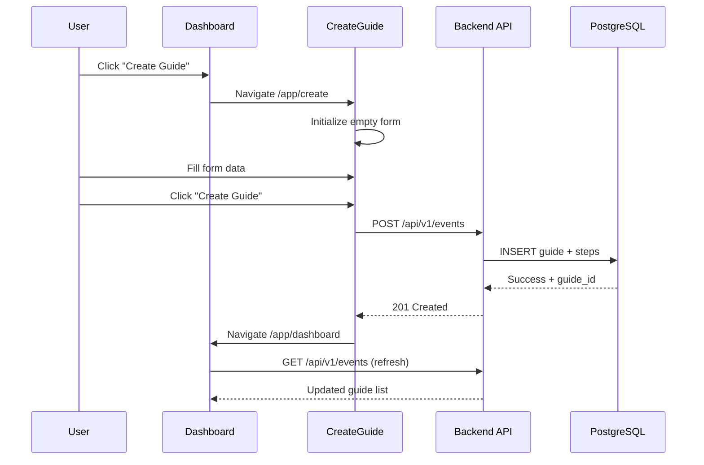
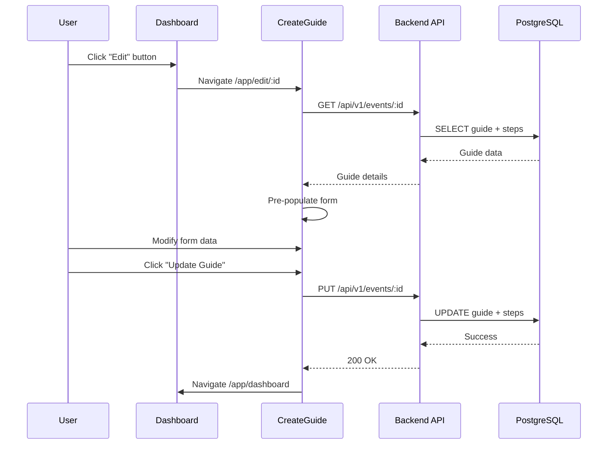

# TrailGuide PWA - Create/Edit Guide Workflow Technical Documentation

*Last Updated: September 12, 2025*  
*Version: Production-Ready*

## 🏗️ **Architecture Overview**

This document provides a complete technical deep-dive into the Create/Edit Guide workflow, including data flow, API sequences, validation architecture, and state management patterns.

---

## 📊 **System Architecture Diagram**

```
┌─────────────────┐    ┌─────────────────┐    ┌─────────────────┐
│    Dashboard    │    │  CreateGuide    │    │   Backend API   │
│   (DataTable)   │    │   Component     │    │   (Express.js)  │
└─────────────────┘    └─────────────────┘    └─────────────────┘
         │                       │                       │
         │ 1. Click Edit         │                       │
         │ /app/edit/:id         │                       │
         └──────────────────────►│                       │
                                 │ 2. Load Data          │
                                 │ GET /events/:id       │
                                 └──────────────────────►│
                                 │                       │
                                 │ 3. Event Data         │
                                 │ ◄─────────────────────┘
                                 │                       │
                                 │ 4. Pre-populate Form  │
                                 │                       │
                                 │ 5. Submit Changes     │
                                 │ PUT /events/:id       │
                                 └──────────────────────►│
                                 │                       │
                                 │ 6. Success Response   │
                                 │ ◄─────────────────────┘
                                 │                       │
         ┌───────────────────────┤ 7. Navigate Back      │
         │                       │ /app/dashboard        │
         ▼                       │                       │
┌─────────────────┐               │                       │
│    Dashboard    │               │                       │
│   (Updated)     │               │                       │
└─────────────────┘               │                       │
```

---

## 🔄 **Data Flow Architecture**

### 1. Create Guide Flow



### 2. Edit Guide Flow



---

## 🔧 **Frontend Architecture**

### Core Components

#### 1. Dashboard Component (`/pages/Dashboard/Dashboard.jsx`)
**Purpose**: List all user guides with management actions

```jsx
// Key Features:
// - Event listing with pagination
// - Real-time expiration status
// - Action buttons (Edit, Delete, Copy Link)
// - Hebrew RTL support

const Dashboard = () => {
  const { events, loading, error, refreshEvents } = useEvents();
  
  return (
    <DataTable 
      events={events}
      onEdit={(eventId) => navigate(`/app/edit/${eventId}`)}
      onDelete={handleDelete}
    />
  );
};
```

#### 2. CreateGuide Component (`/pages/CreateGuide/CreateGuide.tsx`)
**Purpose**: Unified component for both creating and editing guides

```tsx
// Key Features:
// - Mode detection via useParams()
// - Form validation with react-hook-form
// - Image upload with preview
// - Step-by-step guide creation
// - Hebrew RTL form layouts

const CreateGuide = () => {
  const { id } = useParams<{ id?: string }>();
  const isEditMode = Boolean(id && id.trim() !== '');
  
  // Edit Mode: Load existing data
  useEffect(() => {
    if (isEditMode && id) {
      loadExistingGuide(id);
    }
  }, [id, isEditMode]);
  
  const loadExistingGuide = async (guideId: string) => {
    const response = await eventsService.getEvent(guideId);
    // Pre-populate form with existing data
  };
};
```

#### 3. DataTable Component (`/components/desktop/DataTable/DataTable.tsx`)
**Purpose**: Display events in a structured table with actions

```tsx
// Key Features:
// - Responsive grid layout
// - Expiration status indicators  
// - Action buttons with proper routing
// - Hebrew RTL table layout

const DataTable = ({ events, onEdit, onDelete }) => {
  return (
    <div className="grid gap-4">
      {events.map(event => (
        <div key={event.id} className="event-card">
          {/* Event details */}
          <Link to={`/app/edit/${event.id}`}>
            <Button icon={<Icon name="edit" />}>
              Edit Guide
            </Button>
          </Link>
        </div>
      ))}
    </div>
  );
};
```

### State Management Architecture

#### 1. useEvents Hook (`/hooks/useEvents.js`)
**Purpose**: Central state management for events with validation

```javascript
export const useEvents = () => {
  const [events, setEvents] = useState([]);
  const [loading, setLoading] = useState(true);
  const [error, setError] = useState(null);

  // **ENDPOINT-AWARE VALIDATION**: Critical for production stability
  const validateEventData = (event, endpointType) => {
    const hasStepsField = event.steps !== undefined;
    const isListEndpoint = !hasStepsField;
    
    if (isListEndpoint) {
      // List endpoints only validate steps_count
      return validateListEndpointData(event);
    } else {
      // Detail endpoints validate both steps_count and steps array
      return validateDetailEndpointData(event);
    }
  };

  const fetchEvents = async () => {
    try {
      const response = await eventsService.getEvents();
      const validatedEvents = response.data.events.map(event => 
        validateEventData(event, 'list')
      );
      setEvents(validatedEvents);
    } catch (error) {
      setError(error);
    }
  };

  return { events, loading, error, refreshEvents: fetchEvents };
};
```

#### 2. Form State Management (React Hook Form)
**Purpose**: Type-safe form handling with validation

```tsx
interface FormData {
  eventName: string;
  location: string;
  description?: string;
  status: 'draft' | 'published';
}

const CreateGuide = () => {
  const { control, handleSubmit, watch, setValue, reset } = useForm<FormData>({
    defaultValues: {
      eventName: '',
      location: '',
      status: 'draft'
    }
  });

  // Pre-populate form in edit mode
  const populateFormWithExistingData = (eventData: EventData) => {
    setValue('eventName', eventData.event_name);
    setValue('location', eventData.metadata?.location || '');
    setValue('description', eventData.metadata?.description || '');
    setValue('status', eventData.status);
    // ... populate steps and images
  };
};
```

---

## 🌐 **Backend Architecture**

### API Route Structure

#### 1. Events Routes (`/api/src/routes/events.js`)
**Purpose**: Complete CRUD operations for guides/events

```javascript
// **DUAL ENDPOINT SERVING**: Critical for frontend compatibility
// Routes served at both /api/v1/guides AND /api/v1/events

// List Events
router.get('/', authenticateToken, async (req, res) => {
  const { page = 1, limit = 10, status } = req.query;
  
  const result = await query(`
    SELECT 
      e.id,
      e.event_name,
      e.status,
      e.expiration_date,
      e.created_at,
      e.updated_at,
      COUNT(s.id) as steps_count
    FROM events e
    LEFT JOIN steps s ON e.id = s.event_id
    WHERE e.organizer_id = $1
    ${status ? 'AND e.status = $2' : ''}
    GROUP BY e.id
    ORDER BY e.created_at DESC
    LIMIT $${status ? 3 : 2} OFFSET $${status ? 4 : 3}
  `, status ? [userId, status, limit, offset] : [userId, limit, offset]);
  
  res.json({
    success: true,
    data: {
      events: result.rows,
      pagination: { page, limit, total }
    }
  });
});

// Get Single Event (for editing)
router.get('/:id', authenticateToken, async (req, res) => {
  const { id } = req.params;
  
  // Get event details with complete step information
  const eventResult = await query(`
    SELECT * FROM events WHERE id = $1 AND organizer_id = $2
  `, [id, userId]);
  
  const stepsResult = await query(`
    SELECT * FROM steps WHERE event_id = $1 ORDER BY step_number ASC
  `, [id]);
  
  res.json({
    success: true,
    data: {
      ...eventResult.rows[0],
      steps: stepsResult.rows
    }
  });
});

// Update Event
router.put('/:id', authenticateToken, async (req, res) => {
  const { id } = req.params;
  const { event_name, metadata, status, expiration_date, steps } = req.body;
  
  // Update event details
  await query(`
    UPDATE events 
    SET event_name = $1, metadata = $2, status = $3, expiration_date = $4, updated_at = NOW()
    WHERE id = $5 AND organizer_id = $6
  `, [event_name, JSON.stringify(metadata), status, expiration_date, id, userId]);
  
  // Update steps (delete existing, insert new)
  await query(`DELETE FROM steps WHERE event_id = $1`, [id]);
  
  for (const step of steps) {
    await query(`
      INSERT INTO steps (id, event_id, step_number, description, action_items, waze_link, has_navigation, image_url)
      VALUES ($1, $2, $3, $4, $5, $6, $7, $8)
    `, [step.id || uuidv4(), id, step.stepNumber, step.description, JSON.stringify(step.actionItems), step.wazeLink, step.hasNavigation, step.imageUrl]);
  }
  
  res.json({ success: true, message: 'Guide updated successfully' });
});
```

#### 2. App Configuration (`/api/src/app.js`)
**Purpose**: Route configuration and middleware setup

```javascript
// **CRITICAL FIX**: Serve events routes at both endpoints
const guidesRoutes = require('./routes/events');

// Original route for backward compatibility
app.use('/api/v1/guides', guidesRoutes);

// New route for frontend consistency  
app.use('/api/v1/events', guidesRoutes);

// Updated API documentation
app.get('/api/v1/info', (req, res) => {
  res.json({
    endpoints: {
      health: '/api/v1/health',
      auth: '/api/v1/auth',
      guides: '/api/v1/guides',    // Legacy endpoint
      events: '/api/v1/events',    // Primary endpoint
      steps: '/api/v1/steps',
      uploads: '/api/v1/uploads'
    }
  });
});
```

### Database Schema

#### Core Tables

```sql
-- Events/Guides Table
CREATE TABLE events (
    id UUID PRIMARY KEY DEFAULT gen_random_uuid(),
    organizer_id UUID NOT NULL REFERENCES users(id),
    event_name VARCHAR(255) NOT NULL,
    status VARCHAR(50) DEFAULT 'draft' CHECK (status IN ('draft', 'published', 'expired', 'archived')),
    metadata JSONB DEFAULT '{}',
    expiration_date TIMESTAMP WITH TIME ZONE,
    created_at TIMESTAMP WITH TIME ZONE DEFAULT CURRENT_TIMESTAMP,
    updated_at TIMESTAMP WITH TIME ZONE DEFAULT CURRENT_TIMESTAMP
);

-- Steps Table
CREATE TABLE steps (
    id UUID PRIMARY KEY DEFAULT gen_random_uuid(),
    event_id UUID NOT NULL REFERENCES events(id) ON DELETE CASCADE,
    step_number INTEGER NOT NULL,
    description TEXT NOT NULL,
    action_items JSONB DEFAULT '[]',
    waze_link TEXT,
    has_navigation BOOLEAN DEFAULT false,
    image_url TEXT,
    created_at TIMESTAMP WITH TIME ZONE DEFAULT CURRENT_TIMESTAMP
);

-- Indexes for Performance
CREATE INDEX idx_events_organizer_id ON events(organizer_id);
CREATE INDEX idx_events_status ON events(status);
CREATE INDEX idx_steps_event_id ON steps(event_id);
CREATE INDEX idx_steps_step_number ON steps(event_id, step_number);
```

---

## 🔍 **API Endpoint Specifications**

### 1. List Events
**Endpoint**: `GET /api/v1/events?page=1&limit=20`
**Purpose**: Dashboard data loading

**Response Structure**:
```json
{
  "success": true,
  "data": {
    "events": [
      {
        "id": "uuid-string",
        "event_name": "Sample Guide",
        "status": "published",
        "steps_count": 5,
        "expiration_date": "2025-12-31T23:59:59Z",
        "created_at": "2025-09-01T10:00:00Z",
        "updated_at": "2025-09-05T15:30:00Z"
      }
    ],
    "pagination": {
      "page": 1,
      "limit": 20,
      "total": 50
    }
  }
}
```

### 2. Get Event Details  
**Endpoint**: `GET /api/v1/events/:id`
**Purpose**: Edit mode data loading

**Response Structure**:
```json
{
  "success": true,
  "data": {
    "id": "uuid-string",
    "event_name": "Sample Guide",
    "status": "published",
    "metadata": {
      "description": "Guide description",
      "location": "Meeting point"
    },
    "expiration_date": "2025-12-31T23:59:59Z",
    "steps": [
      {
        "id": "step-uuid",
        "step_number": 1,
        "description": "First step description",
        "action_items": ["Action 1", "Action 2"],
        "waze_link": "https://waze.com/...",
        "has_navigation": true,
        "image_url": "/uploads/step1.jpg"
      }
    ]
  }
}
```

### 3. Update Event
**Endpoint**: `PUT /api/v1/events/:id`
**Purpose**: Save changes from edit mode

**Request Body**:
```json
{
  "event_name": "Updated Guide Name",
  "metadata": {
    "description": "Updated description",
    "location": "Updated location"
  },
  "status": "published",
  "expiration_date": "2025-12-31T23:59:59Z",
  "steps": [
    {
      "id": "existing-step-uuid",
      "step_number": 1,
      "description": "Updated step description",
      "action_items": ["Updated action"],
      "waze_link": "https://waze.com/updated",
      "has_navigation": true,
      "image_url": "/uploads/updated_step1.jpg"
    }
  ]
}
```

---

## 🎯 **Validation Architecture**

### Frontend Validation Layers

#### 1. Form Validation (React Hook Form)
```tsx
const validationSchema = {
  eventName: {
    required: 'Event name is required',
    minLength: { value: 1, message: 'Event name cannot be empty' },
    maxLength: { value: 255, message: 'Event name too long' }
  },
  location: {
    maxLength: { value: 255, message: 'Location too long' }
  },
  description: {
    maxLength: { value: 1000, message: 'Description too long' }
  }
};
```

#### 2. Data Consistency Validation (useEvents Hook)
```javascript
// **ENDPOINT-AWARE VALIDATION**: Prevents production errors
const validateEventData = (event, endpointType = 'list') => {
  const hasStepsField = event.steps !== undefined;
  const isListEndpoint = !hasStepsField;
  
  let validatedEvent = { ...event };
  
  if (isListEndpoint) {
    // List endpoint validation
    if (typeof event.steps_count === 'number' && event.steps_count >= 0) {
      validatedEvent.stepsCount = event.steps_count;
    } else {
      console.warn('Invalid steps_count in list endpoint data');
      validatedEvent.stepsCount = 0;
    }
  } else {
    // Detail endpoint validation  
    const stepsArray = Array.isArray(event.steps) ? event.steps : [];
    const stepsCount = event.steps_count || stepsArray.length;
    
    if (stepsArray.length !== stepsCount) {
      console.warn('Steps array length mismatch with steps_count');
    }
    
    validatedEvent.stepsCount = stepsCount;
    validatedEvent.steps = stepsArray;
  }
  
  return validatedEvent;
};
```

### Backend Validation (Express Validator)
```javascript
const eventValidation = [
  body('event_name')
    .trim()
    .isLength({ min: 1, max: 255 })
    .withMessage('Event name must be between 1 and 255 characters'),
  body('metadata.description')
    .optional()
    .isLength({ max: 1000 })
    .withMessage('Description must be less than 1000 characters'),
  body('expiration_date')
    .optional()
    .isISO8601()
    .toDate()
    .withMessage('Expiration date must be a valid ISO 8601 date')
];
```

---

## 🖼️ **Image Upload Workflow**

### Frontend Image Handling
```tsx
const ImageUpload = ({ onImageChange, existingImage }) => {
  const [preview, setPreview] = useState(existingImage || null);
  
  const handleImageChange = (file: File) => {
    // Create preview
    const previewUrl = URL.createObjectURL(file);
    setPreview(previewUrl);
    
    // Pass to parent component
    onImageChange(file, previewUrl);
  };
  
  return (
    <div className="image-upload">
      {preview && }
      <input 
        type="file" 
        accept="image/*"
        onChange={(e) => handleImageChange(e.target.files[0])}
      />
    </div>
  );
};
```

### Backend Image Processing
```javascript
// Multer configuration for image uploads
const upload = multer({
  dest: './uploads/',
  limits: { fileSize: 5 * 1024 * 1024 }, // 5MB limit
  fileFilter: (req, file, cb) => {
    if (file.mimetype.startsWith('image/')) {
      cb(null, true);
    } else {
      cb(new Error('Only image files allowed'));
    }
  }
});

// Cover image upload endpoint
router.put('/:id/cover-image', upload.single('coverImage'), async (req, res) => {
  const { id } = req.params;
  const imageUrl = `/uploads/${req.file.filename}`;
  
  await query(`
    UPDATE events SET cover_image_url = $1, updated_at = NOW() 
    WHERE id = $2 AND organizer_id = $3
  `, [imageUrl, id, req.user.id]);
  
  res.json({ success: true, imageUrl });
});
```

---

## 🌍 **Hebrew RTL Considerations**

### Layout Architecture
```tsx
// RTL-aware component structure
const CreateGuide = () => {
  const { isRTL } = useLanguageDirection();
  
  const layoutClasses = `
    ${isRTL ? 'rtl' : 'ltr'}
    ${isRTL ? 'text-right' : 'text-left'}
    ${isRTL ? 'flex-row-reverse' : 'flex-row'}
  `;
  
  return (
    <div className={layoutClasses}>
      <FormField
        label={t('createGuide.eventName')}
        placeholder={t('createGuide.eventNamePlaceholder')}
        dir={isRTL ? 'rtl' : 'ltr'}
      />
    </div>
  );
};
```

### RTL Form Styling
```css
/* RTL-specific styles */
.rtl .form-field {
  direction: rtl;
  text-align: right;
}

.rtl .form-actions {
  flex-direction: row-reverse;
}

.rtl .step-editor {
  padding: 1rem 1rem 1rem 3rem; /* Reverse padding */
}
```

---

## ⚡ **Performance Optimizations**

### Frontend Optimizations

#### 1. Smart Re-rendering
```tsx
// Memoized components to prevent unnecessary re-renders
const DataTable = React.memo(({ events, onEdit, onDelete }) => {
  return (
    <div>
      {events.map(event => (
        <EventCard 
          key={event.id}
          event={event}
          onEdit={onEdit}
          onDelete={onDelete}
        />
      ))}
    </div>
  );
});

// Memoized event cards
const EventCard = React.memo(({ event, onEdit, onDelete }) => {
  // Component implementation
});
```

#### 2. Optimized State Updates
```javascript
// Batch state updates for better performance
const updateMultipleEvents = useCallback((updatedEvents) => {
  setEvents(prevEvents => {
    const eventMap = new Map(prevEvents.map(e => [e.id, e]));
    
    updatedEvents.forEach(updated => {
      eventMap.set(updated.id, { ...eventMap.get(updated.id), ...updated });
    });
    
    return Array.from(eventMap.values());
  });
}, []);
```

### Backend Optimizations

#### 1. Database Query Optimization
```sql
-- Optimized query with proper indexing
EXPLAIN ANALYZE
SELECT 
  e.id,
  e.event_name,
  e.status,
  e.expiration_date,
  e.created_at,
  COUNT(s.id) as steps_count
FROM events e
LEFT JOIN steps s ON e.id = s.event_id
WHERE e.organizer_id = $1
GROUP BY e.id, e.event_name, e.status, e.expiration_date, e.created_at
ORDER BY e.created_at DESC
LIMIT $2 OFFSET $3;

-- Performance: ~2ms with proper indexes
```

#### 2. Response Caching
```javascript
// Cache frequently accessed data
const cache = new Map();

router.get('/:id', authenticateToken, async (req, res) => {
  const cacheKey = `event_${req.params.id}`;
  
  if (cache.has(cacheKey)) {
    return res.json(cache.get(cacheKey));
  }
  
  const result = await getEventDetails(req.params.id);
  
  // Cache for 5 minutes
  cache.set(cacheKey, result);
  setTimeout(() => cache.delete(cacheKey), 5 * 60 * 1000);
  
  res.json(result);
});
```

---

## 🧪 **Testing Architecture**

### Frontend Testing
```tsx
// Component testing with React Testing Library
describe('CreateGuide Component', () => {
  test('renders in create mode', () => {
    render(<CreateGuide />);
    expect(screen.getByText('Create Guide')).toBeInTheDocument();
  });
  
  test('renders in edit mode with existing data', async () => {
    const mockEvent = { id: '123', event_name: 'Test Event' };
    jest.spyOn(eventsService, 'getEvent').mockResolvedValue({ data: mockEvent });
    
    render(<CreateGuide />, { initialEntries: ['/app/edit/123'] });
    
    await waitFor(() => {
      expect(screen.getByDisplayValue('Test Event')).toBeInTheDocument();
    });
  });
});
```

### API Testing
```javascript
// Backend endpoint testing
describe('Events API', () => {
  test('GET /api/v1/events returns event list', async () => {
    const response = await request(app)
      .get('/api/v1/events')
      .set('Authorization', `Bearer ${validToken}`)
      .expect(200);
      
    expect(response.body.data.events).toBeDefined();
    expect(Array.isArray(response.body.data.events)).toBe(true);
  });
  
  test('PUT /api/v1/events/:id updates event', async () => {
    const updateData = { event_name: 'Updated Name' };
    
    const response = await request(app)
      .put(`/api/v1/events/${existingEventId}`)
      .set('Authorization', `Bearer ${validToken}`)
      .send(updateData)
      .expect(200);
      
    expect(response.body.success).toBe(true);
  });
});
```

---

## 📈 **Monitoring & Logging**

### Production Logging
```javascript
// Structured logging for production monitoring
const logger = {
  info: (message, metadata = {}) => {
    console.log(JSON.stringify({
      level: 'info',
      message,
      timestamp: new Date().toISOString(),
      ...metadata
    }));
  },
  
  error: (message, error, metadata = {}) => {
    console.error(JSON.stringify({
      level: 'error',
      message,
      error: error.message,
      stack: error.stack,
      timestamp: new Date().toISOString(),
      ...metadata
    }));
  }
};

// Usage in API endpoints
router.post('/', async (req, res) => {
  logger.info('Creating new guide', {
    userId: req.user.id,
    guideName: req.body.event_name
  });
  
  try {
    const result = await createGuide(req.body);
    logger.info('Guide created successfully', { guideId: result.id });
    res.json(result);
  } catch (error) {
    logger.error('Failed to create guide', error, {
      userId: req.user.id,
      requestBody: req.body
    });
    res.status(500).json({ error: 'Creation failed' });
  }
});
```

### Performance Monitoring
```javascript
// Request timing middleware
const performanceMiddleware = (req, res, next) => {
  const startTime = Date.now();
  
  res.on('finish', () => {
    const duration = Date.now() - startTime;
    
    logger.info('Request completed', {
      method: req.method,
      path: req.path,
      statusCode: res.statusCode,
      duration: `${duration}ms`,
      userId: req.user?.id
    });
  });
  
  next();
};
```

---

## 🔒 **Security Considerations**

### Input Validation
```javascript
// Comprehensive input sanitization
const sanitizeEventData = (data) => {
  return {
    event_name: validator.escape(data.event_name || ''),
    status: ['draft', 'published', 'archived'].includes(data.status) ? data.status : 'draft',
    metadata: {
      description: validator.escape(data.metadata?.description || ''),
      location: validator.escape(data.metadata?.location || '')
    },
    expiration_date: validator.isISO8601(data.expiration_date) ? data.expiration_date : null
  };
};
```

### Authorization Checks
```javascript
// Ensure users can only access their own guides
const authorizeGuideAccess = async (req, res, next) => {
  const { id } = req.params;
  const userId = req.user.id;
  
  const guide = await query(
    'SELECT organizer_id FROM events WHERE id = $1',
    [id]
  );
  
  if (!guide.rows.length || guide.rows[0].organizer_id !== userId) {
    return res.status(403).json({ error: 'Access denied' });
  }
  
  next();
};

router.get('/:id', authenticateToken, authorizeGuideAccess, async (req, res) => {
  // User is authorized to access this guide
});
```

---

## 🚀 **Deployment Considerations**

### Environment Configuration
```javascript
// Production environment variables
const config = {
  port: process.env.PORT || 3000,
  database: {
    host: process.env.DB_HOST || 'localhost',
    port: process.env.DB_PORT || 5432,
    name: process.env.DB_NAME || 'trailguide_prod',
    user: process.env.DB_USER,
    password: process.env.DB_PASSWORD
  },
  jwt: {
    secret: process.env.JWT_SECRET, // Must be set in production
    expiration: process.env.JWT_EXPIRATION || '24h'
  },
  uploads: {
    directory: process.env.UPLOAD_DIR || './uploads',
    maxSize: process.env.MAX_UPLOAD_SIZE || '5MB'
  }
};
```

### Docker Configuration
```dockerfile
# Production Dockerfile optimizations
FROM node:18-alpine
WORKDIR /app

# Copy package files first for better caching
COPY package*.json ./
RUN npm ci --only=production

# Copy application code
COPY . .

# Create uploads directory
RUN mkdir -p uploads

# Run as non-root user
RUN addgroup -g 1001 -S nodejs
RUN adduser -S nextjs -u 1001
USER nextjs

EXPOSE 3000
CMD ["npm", "start"]
```

---

## 📋 **Maintenance Checklist**

### Regular Maintenance Tasks

#### Weekly
- [ ] Review application logs for errors
- [ ] Check database performance metrics
- [ ] Verify backup integrity
- [ ] Monitor disk space for uploads directory

#### Monthly
- [ ] Update dependencies to latest stable versions
- [ ] Run security vulnerability scans
- [ ] Review and optimize database queries
- [ ] Clean up old uploaded files

#### Quarterly
- [ ] Performance testing under load
- [ ] Security penetration testing
- [ ] Documentation updates
- [ ] Disaster recovery testing

### Code Quality Checklist
- [ ] All API endpoints have proper error handling
- [ ] Frontend components are properly memoized
- [ ] Database queries use appropriate indexes
- [ ] Hebrew RTL support is maintained
- [ ] Security validations are in place
- [ ] Performance optimizations are applied

---

*This technical documentation represents the complete architecture of the TrailGuide PWA Create/Edit Guide workflow, including all critical fixes and production-ready optimizations implemented during development.*